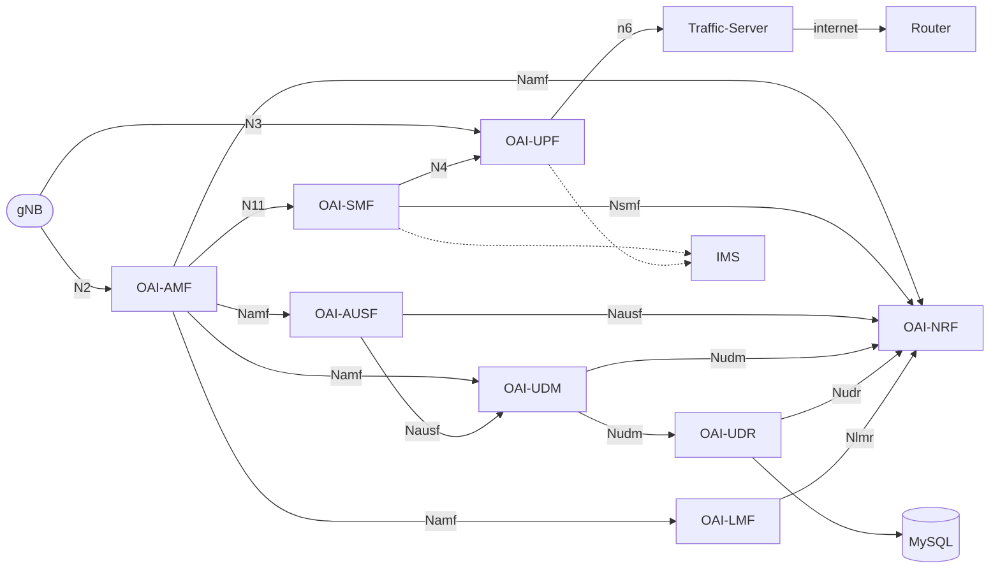

# 🛰️ Parent Helm Charts for Deploying Basic OAI-5G Core Network

This guide explains how to deploy the OpenAirInterface (OAI) 5G Core using Helm charts.

## 📦 Components in the Basic Deployment

The basic 5G Core deployment includes the following network functions (NFs):

1. OAI-AMF — Access and Mobility Management Function
2. OAI-SMF — Session Management Function
3. OAI-NRF — Network Repository Function
4. OAI-UDR — Unified Data Repository
5. OAI-AUSF — Authentication Server Function
6. OAI-UDM — Unified Data Management
7. OAI-UPF — User Plane Function
8. OAI-LMF — Location Management Function
9. MySQL — Subscriber database
10. Traffic Server - Just a simple iperf3 server

## ⚙️ Configuration Structure

Starting from version 2.0.0, OAI 5G Core uses the following configuration files:

1. `config.yaml` — contains network function (NF) configurations
2. `values.yaml` — defines infrastructure settings, image details, and deployment parameters

## 🌐 Connectivity Requirements

If your gNB (Next Generation NodeB) resides in a different cluster or subnet than the pod subnet, ensure the following:

1. AMF and UPF must be reachable from the gNB host machine.
2. You may use Multus interfaces for AMF and UPF.

The UPF `n3` interface must have connectivity to the gNB host or container.

## 🚀 Deployment Steps

### Step 1 — Update Helm Dependencies

Whenever you modify sub-charts or freshly clone the repository, update dependencies:

```bash
helm dependency update
```

### Step 2 — Install the Parent Chart

Deploy the full 5G Core using Helm:

```bash
helm install oai-5g-basic .
```

## 🔧 UPF Interface Configuration Notes

If you use OAI-UPF with a single interface, enable only one of the following interfaces.

For example, to use the Multus N3 interface:

```yaml
  multus:
    ## If you don't want to add a default route in your pod then replace this field with ""
    enabled: false
    interfaces:
      - name: "n3"
        hostInterface: "eth0"
        ipAdd: "172.21.12.95"
        netmask: "22"
        defaultRoute: "172.21.7.254"
        enabled: true
      - name: "n4"
        hostInterface: "eth0"
        ipAdd: "192.168.24.2"
        netmask: "24"
        enabled: false
      - name: "n6"
        hostInterface: "eth0"
        ipAdd: "192.168.22.2"
        netmask: "24"
        enabled: false
      - name: "n9"
        hostInterface: "eth0"
        ipAdd: "192.168.23.2"
        netmask: "24"
        enabled: false
      - name: "sbi"
        hostInterface: "eth0"
        ipAdd: "172.21.8.91"
        netmask: "22"
        gateway: "172.21.11.254"
        enabled: false
```

✅ Ensure the N3 subnet is reachable from the gNB.
