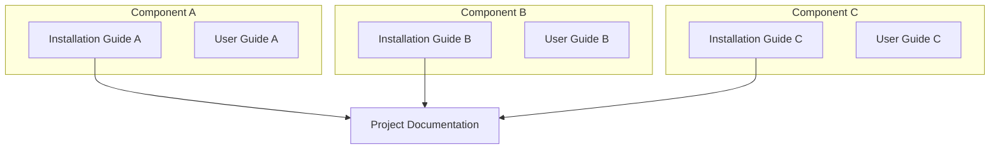
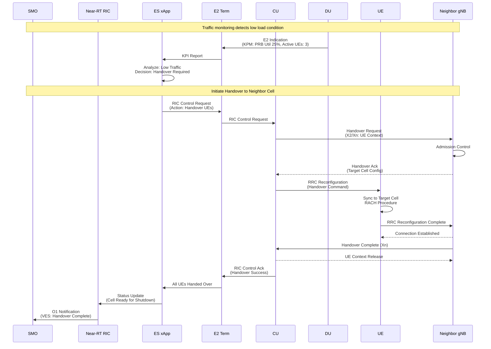
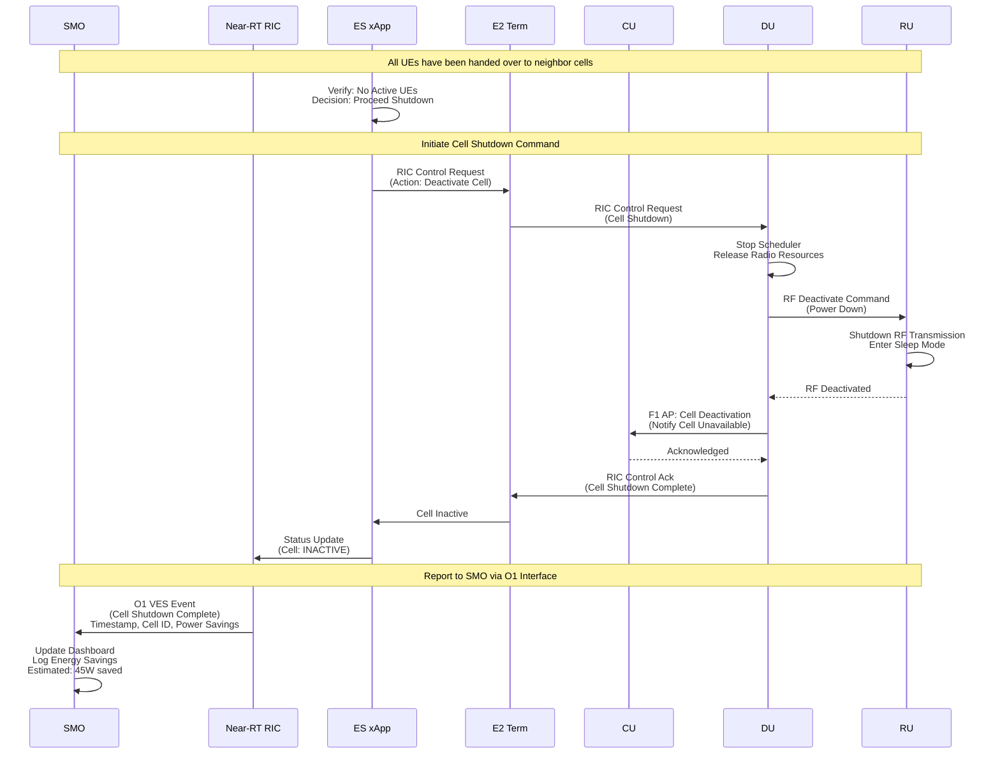
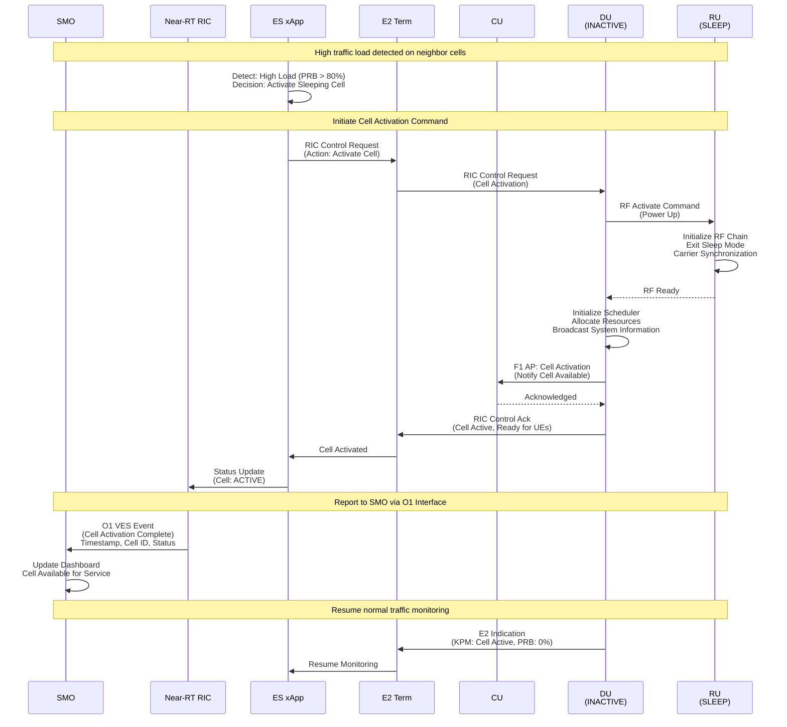
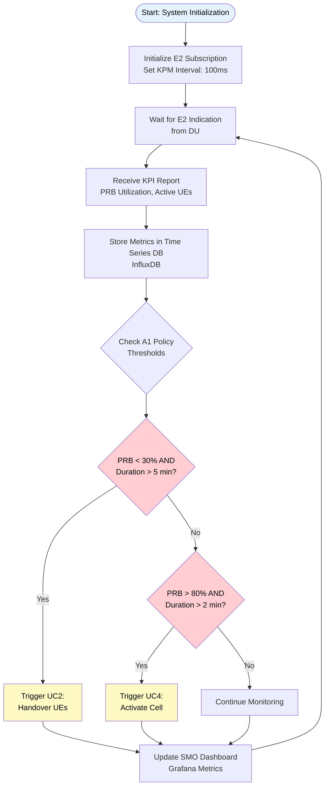
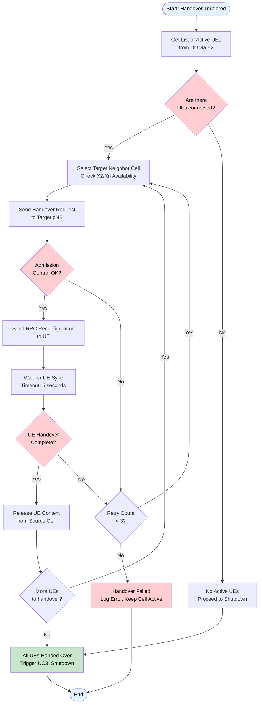
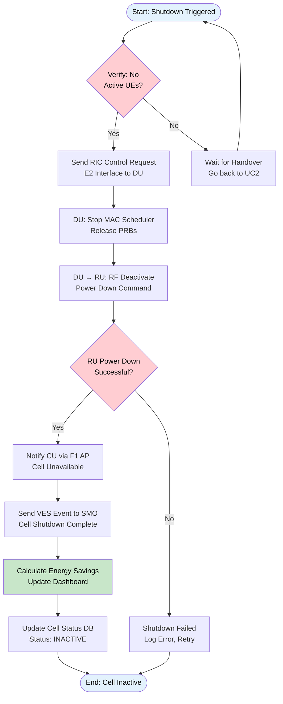
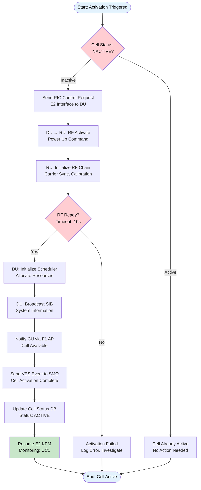

# LLM-Driven gNB Reasoning & Adjustment Project Documentation
<h1 align="center">LLM-Driven gNB Reasoning & Adjustment Project Documentation - Guideline</h1>

---

> [!WARNING]
> The [SOP template of project documentation](https://github.com/bmw-ece-ntust/SOP/blob/master/project-documentation.md) is regularly updated.  
> Please check it regularly.

> [!CAUTION]
> **Confidentiality Notice:**
> Keep this document **private** by default. Publish only after paper acceptance.
> Request repository access from the GitHub admin.

---

> [!NOTE]
> **Documentation Structure:**
>
> - **Installation Guide**: System setup, configuration, and deployment procedures
> - **User Guide**: Operating instructions for the deployed system
> - **Project Documentation**: Technical architecture, use cases, MSC, flowcharts, and class diagrams with links to installation guides

**Documentation Hierarchy:**

## Table of Contents

> [!TIP]
> **Auto-Generate Table of Contents:**
> Use [Markdown All in One](https://marketplace.visualstudio.com/items?itemName=yzhang.markdown-all-in-one#table-of-contents) extension in VS Code for automatic TOC generation.

- [LLM-Driven gNB Reasoning & Adjustment Project Documentation](#llm-driven-gnb-reasoning--adjustment-project-documentation)
- [Introduction](#introduction)
- [Execution Status](#execution-status)
- [Minimum Requirements](#minimum-requirements)
- [System Architecture](#system-architecture)
  - [Software Requirements and Versions](#software-requirements-and-versions)
  - [Components Explanation](#components-explanation)
    - [SMO Layer - O-RAN SC \[L Release\]](#smo-layer---o-ran-sc-l-release)
    - [Near-RT RIC - FlexRIC \[v1.0.0\]](#near-rt-ric---flexric-v100)
    - [Central Unit - OAI \[2024.w40\]](#central-unit---oai-2024w40)
    - [Distributed Unit - OAI \[2024.w40\]](#distributed-unit---oai-2024w40)
    - [Radio Unit - USRP B210](#radio-unit---usrp-b210)
    - [User Equipment](#user-equipment)
- [Use Case Diagram](#use-case-diagram)
- [Message Sequence Chart (MSC)](#message-sequence-chart-msc)
  - [UC2: Handover UEs to Neighbor Cell](#uc2-handover-ues-to-neighbor-cell)
  - [UC3: Shutdown Cell](#uc3-shutdown-cell)
  - [UC4: Activate Cell](#uc4-activate-cell)
- [Flowchart](#flowchart)
  - [UC1: Monitor Traffic Load](#uc1-monitor-traffic-load)
  - [UC2: Handover UEs to Neighbor Cell](#uc2-handover-ues-to-neighbor-cell-1)
  - [UC3: Shutdown Cell](#uc3-shutdown-cell-1)
  - [UC4: Activate Cell](#uc4-activate-cell-1)
- [Class Diagram](#class-diagram)
- [System Parameters](#system-parameters)
- [References](#references)

## Introduction

> [!NOTE]
> **Guideline:** Define the research background, problem statement, contributions, and challenges. Structure the introduction to be suitable for academic paper publication.
>
> **Required Content:**
>
> 1. **Background**: Describe the problem domain and current state-of-the-art
> 2. **Importance**: Explain why solving this problem matters (technical and practical impact)
> 3. **Contribution**: Present your proposed solution and key innovations
> 4. **Challenges**: Identify implementation challenges and how you address them
>
> **Citation Management:**
>
> - Maintain all references in a `.bib` file for bibliography management
> - Use [Pandoc](https://pandoc.org/) to cite references from the `.bib` file in Markdown
> - The `.bib` file can be directly reused for paper writing in LaTeX

**Example:**
這份文件提出一個基於大型語言模型（LLM）的自動化推理框架，用於解決 5G gNodeB (gNB) 參數調整過程中人工排障耗時且易出錯的問題 。該文件利用 OSS-GPT 120B 生成具備故障特徵的合成訓練數據，產生結構化的推理軌跡（Reasoning Traces），以此對 QwQ-32B 模型進行監督式微調（SFT），使其能精確地從非結構化的網路日誌中推導出根因分析並提出配置建議。

這份文件以
- 開源的 Open5GS 做為 5G 核心網路
- 開源的 OpenAirInterface (OAI) 基地台軟體/RF模擬器/UE模擬器做為測試平台收集 gNB 的錯誤日誌 
- 開源的 NeMo-Skills 做為訓練與驗證模型的框架。
- NVIDIA NIM API 簡化部署 OSS-GPT 120B 的過程。

1. **Background**: 
   - 5G 無線存取網路（RAN）正朝向解耦式與模組化架構發展，將 gNodeB (gNB) 拆分為中央單元（CU）與分佈單元（DU）。
   - 此架構雖提升了擴展性，但顯著增加了網路操作與維護（O&M）的複雜度 。
   - 不同的模組或者單元會在運作期間會產生大量非結構化的文字日誌，包含信令程序、錯誤報告與效能指標 。
   - 目前主要依賴人工專家分析日誌以進行根因分析（RCA），該過程極其耗時且容易出錯，且經驗不易傳承。
2. **Importance**: 
   - 自動化診斷平台：為研究 5G gNB 在不同配置下的錯誤行為、根因分析（RCA）與參數調整提供逼真的模擬環境 。
   - 端到端自動化集成：實現從數據採集到配置下發的閉環流程，使其能與現有的服務管理編排（SMO）與電信管理系統集成 。
   - 合成推理建模：利用 OSS-GPT 120B作為教師模型，針對 CU/DU 配置與日誌生成推理軌跡（Reasoning Traces），引導 QwQ-32B 學習專家級的診斷邏輯 。
3. **Contribution**: 
   - 日誌至推理軌跡管道：開發一套自動化流程，將原始的 gNB 錯誤日誌轉化為結構化的推理軌跡，建立日誌特徵與配置建議之間的邏輯聯繫 。
   - 領域專用模型的推理強化：透過 SFT 訓練流程，成功將 5G 領域知識與複雜的排障邏輯植入 LLM，提升模型在網路診斷中的因果推理能力 。
   - 實作一個 LLM 推理循環，該循環建議配置變更並使用來自 gNB 的回饋日誌驗證配置。
4. **Challenges**: 
   - 電信領域標註數據稀缺：5G 網路日誌涉及高度專業的領域知識且缺乏公開的大規模標註數據，導致模型難以直接進行監督式學習 。
   - 日誌結構的複雜性與非結構化特性：gNB 產生的日誌包含異構且高度依賴上下文的資訊（如信令追蹤、模組交互、效能指標），難以透過傳統機器學習進行語義理解與因果推理 。
   - 部件故障的關聯分析：當錯誤發生在 CU 與 DU 的交互接口（如 F1）時，模型需具備跨組件的關聯推理能力，而非僅分析單一模組的局部日誌 。

## Execution Status

**Guideline:** Track implementation progress with a status table showing all major development and integration steps. Use status icons (✅ ⏳ ❌) to indicate progress. Include specific dates, outcomes, and error descriptions where applicable.

**Example:**

> [!NOTE]
> **Status Icons:**
> - ✅ Completed successfully
> - ⏳ In progress / Pending
> - ❌ Error / Failed (with explanation)

| Step                                                                  | Status | Timeline   | Execution Status / Notes                                |
| --------------------------------------------------------------------- | ------ | ---------- | ------------------------------------------------------- |
| Open5GS Installation for Ubuntu and UE registration                   | ✅     | 2024-10-15 | 本文件紀錄如何在 Ubuntu 環境下，安裝 Open5GS 核心網路。                                                        |
| [OAI-5G-RAN-on-Kubernetes-Deployment-Guide.md](#smo-installation)     | ✅     | 2024-10-15 | 本文件紀錄如何在 Kubernetes 環境下，利用 Helm Chart 部署 OAI 5G RAN 元件（CU、DU），並透過 RFSimulator 與外部 Core Network (Open5GS) 進行端到端連通測試。                                                        |
| [Chart-Custom-Config-Guide](#ho-xapp-development)                     | ✅     | 2024-10-23 | 本文件紀錄針對原始 Chart 中 values.yaml 無法有效控制所有關鍵參數的問題，所進行的結構性優化與配置調整。  |
| [Mutated Configuration Generator](#mutated-configuration-generator)                   | ⏳     | 2024-10-25 |     |
| [Config-Runner](#config-runner)                                                       | ⏳     | 2024-10-26 |     |
| [Reasoning Trace Generator (python)](#reasoning-trace-generator-python)               | ⏳     | 2024-10-28 |     |
| [Reasoning Trace Generator (NEMO-Skills)](#reasoning-trace-generator-nemo-skills)     | ⏳     | 2024-10-28 |     |
| Performance Benchmarking                                              | ⏳     | 2024-10-28 |     |
| Documentation and Reporting                                           | ⏳     | 2024-10-30 |     |

## Minimum Requirements

> [!NOTE]
> **Guideline:** Specify the minimum hardware and software requirements needed to deploy and run the project. Include CPU, GPU, memory, storage, and network requirements.
>
> **Required Content:**
>
> 1. **Hardware Requirements**: CPU, GPU, RAM, storage, network adapters
> 2. **Software Requirements**: OS, kernel version, runtime dependencies, tools
> 3. **Component-Specific Requirements**: List requirements for each major component (SMO, RIC, DU, RU, etc.)
> 4. **Version Specifications**: Include exact versions for reproducibility

### Hardware Requirements

- [OAI gNB](https://gitlab.eurecom.fr/oai/openairinterface5g/-/blob/develop/doc/system_requirements.md#simulated-radio)

| Component | Minimum Requirements | Remarks |
|---|---|---|
| CPU | 2 Cores | Dedicated processing for gNB is highly recommended. |
| Frequency | > 2.0 GHz | Required to prevent communication timeouts caused by processing latency. |
| Memory | 4 GiB | |
| Instruction Set | AVX2 | Mandatory; used for accelerating Physical Layer (L1) computations. |
| Kernel Protocol | SCTP | Essential for Core Network interfacing (N2 Interface); must be enabled on the host. |

### Software Requirements

| Package | Version | Primary Purpose |
|---|---|---|
| PyYAML | 5.4.1 | Reading and modifying values.yaml and 5G configurations. |
| ruamel.yaml | 0.19.1 | Advanced YAML parsing with support for preserving comments. |
| requests | 2.31.0 | Handling HTTP/REST API requests for network orchestration. |
| httpx | 0.28.1 | High-performance async HTTP client for 5G service APIs. |
| python-dotenv | 0.19.2 | Managing project environment variables and secure credentials. |
| openai | 2.15.0 | Invoking LLMs for reasoning and synthetic data generation. |
| pydantic | 2.12.5 | "Data validation for 5G parameters (e.g., IMSI, Keys, DNN)." |
| numpy | 2.0.2 | Numerical computing and efficient log data processing. |

## System Architecture

> [!NOTE]
> **Draw.io Files Management:**
>
> If you create system architecture diagrams using draw.io:
>
> - Store the raw `.drawio` files in the `./docs/drawio` folder of the GitHub repository
> - Export diagrams as PNG/SVG and embed them in the documentation
> - Keep `draw.io` files versioned for easy updates and maintenance
> - Use consistent naming: `<project-name>.drawio`

### High-Level System Architecture

---
Consists of the following major components:
The system consists of three main components: 
- An operator
    - May be a human, an automated system, or a large language model (LLM) equipped with RAN-specific domain knowledge, including RAN terminology and log semantics. 
- A management platform
    - May be an Operations Support System (OSS) used in traditional telecom networks or a Service Management and Orchestration (SMO) framework defined by the O-RAN ALLIANCE.
- An open and disaggregated RAN.
    - CU/DU/RU

Through the management platform, the operator configures RAN components and collects operational logs from the disaggregated RAN using standardized open interfaces (e.g., the O2 interface) and YANG models specified by 3GPP

> [!NOTE]
> **Guideline:** Draw the end-to-end system architecture using Mermaid diagrams. For each component, provide:
>
> - A **brief component name** with version
> - A **paragraph explanation** of its functionality
> - **Hyperlinks** to corresponding installation guides (use placeholder links)
>
> This format enables easy adaptation into academic paper publications.

### Software Requirements and Versions

| Component        | Implementation    | Version/Release                                                              | Purpose                              |
| ---------------- | ----------------- | ---------------------------------------------------------------------------- | ------------------------------------ |
| SMO              | O-RAN SC          | [L Release (2024.06)](https://wiki.o-ran-sc.org/display/ORAN/L+Release)      | Service Management and Orchestration |
| Kafka            | Apache Kafka      | [3.6.2](https://archive.apache.org/dist/kafka/3.6.2/)                        | Message broker for event streaming   |
| CU-CP            | OAI               | [2024.w40](https://gitlab.eurecom.fr/oai/openairinterface5g/-/tags/2024.w40) | Central Unit Control Plane           |
| CU-UP            | OAI               | [2024.w40](https://gitlab.eurecom.fr/oai/openairinterface5g/-/tags/2024.w40) | Central Unit User Plane              |
| DU               | OAI               | [2024.w40](https://gitlab.eurecom.fr/oai/openairinterface5g/-/tags/2024.w40) | Distributed Unit                     |
| RU (rfsimulator) | OAI               | [2024.w40](https://gitlab.eurecom.fr/oai/openairinterface5g/-/blob/develop/radio/rfsimulator/README.md)      | Radio Unit|
| UE               | OAI               | [2024.w40](https://gitlab.eurecom.fr/oai/openairinterface5g/-/blob/develop/doc/NR_SA_Tutorial_OAI_nrUE.md#rfsimulator-1)          | User Equipment (5G modem)            |
| Operating System | Ubuntu            | [22.04.5 LTS](https://releases.ubuntu.com/jammy/)                            | Base system platform                 |
| Docker           | Docker Engine     | [24.0.9](https://docs.docker.com/engine/release-notes/24.0/#2409)            | Container runtime                    |
| Kubernetes       | K8s               | [1.28.15](https://github.com/kubernetes/kubernetes/releases/tag/v1.28.15)    | Container orchestration              |

> [!NOTE]
> **O-RAN Version Naming Convention:**
>
> - **O-RAN Alliance Releases**: Named alphabetically (A, B, C, D, E, F, G, H, I, J, K, L, M...)
> - **O-RAN SC (Software Community)**: Follows Alliance releases with specific dates (e.g., L Release = 2024.06)
> - **OAI Releases**: Version numbers (v1.x, v2.x) with weekly tags (e.g., 2024.w40 = week 40 of 2024)
> - **Current Latest**: L Release (June 2024), M Release expected in December 2024

### Components Explanation

## Use Case Diagram

> [!NOTE]
> **Guideline:** Define the system features and use cases that fulfill project requirements. Use Mermaid diagrams to illustrate actors, use cases, and their relationships. Each use case will be detailed in the MSC section.
>
> **Required Content:**
>
> 1. **Use Case Diagram**: Mermaid diagram showing actors and their interactions with the system
> 2. **Actor Definitions**: Identify all external entities (users, systems, components)
> 3. **Use Case Definitions**: List all functional capabilities with clear names
> 4. **Relationships**: Show interactions between actors and use cases

## Message Sequence Chart (MSC)

> [!NOTE]
> **Guideline:** Illustrate component interactions for each use case using sequence diagrams. Focus on message flow across system interfaces (O1, A1, E2, F1 for O-RAN). MSC shows **component communication**, while flowcharts show **algorithm logic**.
>
> **Required Content:**
>
> 1. **Sequence Diagrams**: Mermaid diagrams showing message exchanges between components
> 2. **Interface Labels**: Include interface names (O1, A1, E2, F1, eCPRI, Uu)
> 3. **Message Content**: Document message parameters and data structures
> 4. **Timing**: Show order of operations and dependencies
> 5. **Error Scenarios**: Include alternative flows and error handling where relevant

**Example:**
### UC1:
### UC2: Handover UEs to Neighbor Cell

This MSC shows the handover procedure when the Energy Saving xApp decides to move UEs from a low-traffic cell to a neighbor cell before shutdown.

### UC3: Shutdown Cell

This MSC shows the cell shutdown procedure after all UEs have been successfully handed over to neighbor cells.

### UC4: Activate Cell

This MSC shows the cell activation procedure when traffic load increases and additional capacity is needed.

## Flowchart

> [!NOTE]
> **Guideline:** Define the logic and decision-making algorithms for each use case. Flowcharts illustrate **algorithm logic** (conditional branches, loops, decision criteria), while MSC shows **component interactions**.
>
> **Required Content:**
>
> 1. **Decision Points**: Show conditional branches using diamond shapes
> 2. **Logic Flow**: Include if/else logic and loops with clear conditions
> 3. **Threshold Values**: Document criteria and parameters for decisions
> 4. **Error Handling**: Show alternative paths for failure scenarios
> 5. **Clear Styling**: Use consistent colors and ensure text readability

**Example:**

### UC1: Monitor Traffic Load

### UC2: Handover UEs to Neighbor Cell

### UC3: Shutdown Cell

### UC4: Activate Cell

## Class Diagram

> [!NOTE]
> **Guideline:** Define the software architecture using Object-Oriented Programming (OOP) principles. Include classes, attributes (following 3GPP standards), methods, and relationships (inheritance, composition, aggregation).
> Include the parameters defined on the [System Parameters](#system-parameters) table.
>
> **Required Content:**
>
> 1. **Classes**: Define main classes following OOP design patterns
> 2. **Attributes**: Use 3GPP parameter names (e.g., `DRB.PrbUtilDL`, `RRC.ConnectedUE`)
> 3. **Methods**: Define functions that execute MSC call-flows
> 4. **Relationships**: Show inheritance (is-a), composition (has-a), aggregation, dependencies
> 5. **Access Modifiers**: Use `-` for private, `+` for public, `#` for protected
> 6. **Data Types**: Specify types (String, Integer, Float, List, etc.)
>
> **OOP Principles:**
>
> - **Encapsulation**: Group related data and methods in classes
> - **Abstraction**: Use interfaces or abstract classes where applicable
> - **Inheritance**: Show class hierarchies (e.g., `BaseXApp` → `EnergySavingXApp`)
> - **Polymorphism**: Define overridable methods

## System Parameters

### CU Parameters

| Parameter Name | Data Type | Unit | Default Value | Description |
| :--- | :--- | :--- | :--- | :--- |
| Active_gNBs | List (String) | N/A | N/A | List of gNB names to be activated upon startup. |
| Asn1_verbosity | String | N/A | """none""" | Logging verbosity level for ASN1 encoding/decoding. |
| gNB_ID | Hexadecimal | N/A | 0xe00 | Unique identifier for the gNB (24 or 32 bits). |
| gNB_name | String | N/A | """cu-rfsim""" | Human-readable name of the gNB. |
| tracking_area_code | Integer | N/A | 1 | Tracking Area Code (TAC) used for UE location management by the AMF. |
| mcc | Integer | N/A | 208 | Mobile Country Code. |
| mnc | Integer | N/A | 99 | Mobile Network Code. |
| mnc_length | Integer | N/A | 2 | Number of digits in the MNC (typically 2 or 3). |
| sst | Integer | N/A | 1 | Slice/Service Type for Network Slicing. |
| sd | Hexadecimal | N/A | 0xffffff | Slice Differentiator to further identify a specific slice. |
| nr_cellid | Integer | N/A | N/A | Unique NR Cell Identity. |
| tr_s_preference | String | N/A | """f1""" | Transport Split Preference (F1 interface indicates CU/DU split). |
| local_s_address | IPv4 String | N/A | N/A | Local IP address for the F1 interface. |
| remote_s_address | IPv4 String | N/A | N/A | Remote IP address (DU) for the F1 interface. |
| local_s_portc | Integer | Port | 501 | Local port for F1-C (Control Plane). |
| local_s_portd | Integer | Port | 2153 | Local port for F1-U (User Plane). |
| remote_s_portc | Integer | Port | 500 | Remote port for F1-C (Control Plane). |
| remote_s_portd | Integer | Port | 2153 | Remote port for F1-U (User Plane). |
| SCTP_INSTREAMS | Integer | N/A | 2 | Number of SCTP input streams. |
| SCTP_OUTSTREAMS | Integer | N/A | 2 | Number of SCTP output streams. |
| amf_ip_address | List (IPv4) | N/A | N/A | List of IP addresses for the Access and Mobility Management Function (AMF). |
| GNB_IPV4_ADDRESS_FOR_NG_AMF | IPv4 String | N/A | N/A | Local IP for the NG-C (N2) interface to the AMF. |
| GNB_IPV4_ADDRESS_FOR_NGU | IPv4 String | N/A | N/A | Local IP for the NG-U (N3) interface to the UPF. |
| GNB_PORT_FOR_S1U | Integer | Port | 2152 | GTP-U port for user plane data (standard is 2152). |
| near_ric_ip_addr | IPv4 String | N/A | N/A | IP address of the Near-Real-Time RIC (O-RAN). |
| ciphering_algorithms | List (String) | N/A | [""nea0""] | List of supported ciphering algorithms. |
| integrity_algorithms | List (String) | N/A | [""nia2"", ""nia0""] | List of supported integrity protection algorithms. |
| drb_ciphering | String | Boolean | """yes""" | Enables or disables ciphering for Data Radio Bearers (DRB). |
| drb_integrity | String | Boolean | """no""" | Enables or disables integrity protection for DRBs. |
| global_log_level | String | N/A | """info""" | Verbosity level for global system logs. |
| pdcp_log_level | String | N/A | """info""" | Verbosity level for PDCP layer logs. |
| rrc_log_level | String | N/A | """info""" | Verbosity level for RRC layer logs. |
| f1ap_log_level | String | N/A | """info""" | Verbosity level for F1AP layer logs. |
| ngap_log_level | String | N/A | """info""" | Verbosity level for NGAP layer logs. |

### DU Parameters

| Parameter Name | Data Type | Unit | Default Value | Description |
| :--- | :--- | :--- | :--- | :--- |
| Active_gNBs | List (String) | N/A | "du-rfsim" | Name of the active gNB instance. |
| gNB_DU_ID | Hexadecimal | N/A | 0xe00 | Unique identifier for the Distributed Unit. |
| nr_cellid | Integer | N/A | 12345678 | The 5G NR Cell Identity. |
| physCellId | Integer | N/A | 0 | Physical Cell ID (PCI). |
| absoluteFrequencySSB | Integer | ARFCN | 621312 | The absolute frequency of the SSB. |
| dl_absoluteFrequencyPointA | Integer | ARFCN | 620040 | Frequency of ""Point A"" for the downlink. |
| dl_carrierBandwidth | Integer | PRB | 106 | Downlink bandwidth (106 PRBs ≈ 40MHz for 30kHz SCS). |
| ul_frequencyBand | Integer | Band | 78 | Operating NR frequency band (e.g., Band n78). |
| pMax | Integer | dBm | 20 | Maximum allowed transmit power in the cell. |
| subcarrierSpacing | Integer | N/A | 1 | SCS index (1 = 30kHz, 0 = 15kHz). |
| dl_UL_TransmissionPeriodicity | Integer | Index | 6 | TDD Periodicity (6 = 5ms). |
| nrofDownlinkSlots | Integer | Slots | 7 | Number of full DL slots in a TDD period. |
| nrofUplinkSlots | Integer | Slots | 2 | Number of full UL slots in a TDD period. |
| ssPBCH_BlockPower | Integer | dBm | -25 | Transmit power of the SS/PBCH block. |
| tr_s_preference | String | N/A | "local_L1" | Transport preference between MAC and L1. |
| tr_n_preference | String | N/A | "f1" | Transport preference for the Northbound interface (F1). |
| local_n_address | IPv4 String | N/A | "192.168.71.171" | Local IP address for the F1-U interface. |
| remote_n_address | IPv4 String | N/A | "192.168.71.150" | Remote CU IP address for the F1-U interface. |
| local_n_portd | Integer | Port | 2153 | Local UDP port for F1 data. |
| pusch_TargetSNRx10 | Integer | dB (x10) | 200 | Target SNR for PUSCH (200 = 20dB). |
| prach_dtx_threshold | Integer | N/A | 200 | Threshold for PRACH DTX detection. |
| ofdm_offset_divisor | Integer | N/A | 8 | Divisor used for OFDM time-domain offset calculation. |
| local_rf | String (Yes/No) | N/A | "yes" | Determines if the RF hardware is local. |
| nb_tx / nb_rx | Integer | Antennas | 1 | Number of Transmit/Receive antennas. |
| att_tx / att_rx | Integer | dB | 0 | Attenuation applied to TX and RX paths. |
| max_rxgain | Integer | dB | 114 | Maximum gain of the receiver. |
| clock_src | String | N/A | "internal" | Source of the system clock (Internal/External). |
| serveraddr | String | N/A | "server" | Address of the RF Simulator server. |
| global_log_level | String | N/A | "info" | General logging detail level. |

### UE Parameters

| Parameter Name | Data Type | Unit | Default Value | Description |
| :--- | :--- | :--- | :--- | :--- |
| fullImsi | String | N/A | "001010000062653" | International Mobile Subscriber Identity; the unique ID for the SIM card. |
| fullKey | Hexadecimal | N/A | "8baf4...6862" | The 128-bit secret key (K) shared between the USIM and the Home Subscriber Server (HSS/UDM). |
| opc | Hexadecimal | N/A | "8e27b...605d" | Operator Configuration Key; used in the Authentication and Key Agreement (AKA) process. |
| dnn | String | N/A | "Internet" | Data Network Name; equivalent to APN in 4G, defines the external network to access. |
| sst | Integer | N/A | 1 | Slice/Service Type; part of the NSSAI to define the network slice for the UE. |
| sd | Hexadecimal/Int | N/A | "16777215" | Slice Differentiator; optional value to distinguish between slices of the same SST. |
| radio | String | N/A | "rfsim" | Defines the radio frontend type (e.g., RF Simulator or USRP hardware like B2xx/N3xx). |

## References
> [!NOTE]
> **Guideline:** Use IEEE citation style for all references. Cite references in the text using numerical format [1], [2], etc., and list them in order of appearance at the end of the document.
>
> **Citation Format:**
>
> - In-text citations: Use square brackets with numbers [1], [2], [3]
> - Multiple citations: [1], [2] or [1]–[3] for ranges
> - References list: Number sequentially in order of first appearance
>
> **For Pandoc Conversion:**
>
> - Create a `references.bib` file with BibTeX entries
> - Use Pandoc with IEEE CSL: `pandoc document.md --bibliography=references.bib --citeproc --csl=ieee.csl -o output.pdf`
> - Download `ieee.csl` from: https://github.com/citation-style-language/styles/blob/master/ieee.csl

**Example References (IEEE Format):**

[1] 3GPP, "Management and orchestration; 5G performance measurements," 3rd Generation Partnership Project (3GPP), Technical Specification TS 28.552 V18.5.0, 2024. [Online]. Available: https://www.3gpp.org/ftp/Specs/archive/28_series/28.552/

[2] 3GPP, "NR; NR and NG-RAN Overall description; Stage-2," 3rd Generation Partnership Project (3GPP), Technical Specification TS 38.300 V18.0.0, 2024. [Online]. Available: https://www.3gpp.org/ftp/Specs/archive/38_series/38.300/

[3] 3GPP, "NR; Radio Resource Control (RRC) protocol specification," 3rd Generation Partnership Project (3GPP), Technical Specification TS 38.331 V18.4.0, 2024. [Online]. Available: https://www.3gpp.org/ftp/Specs/archive/38_series/38.331/

[4] 3GPP, "Management and orchestration; Generic management services," 3rd Generation Partnership Project (3GPP), Technical Specification TS 28.532 V18.5.0, 2024. [Online]. Available: https://www.3gpp.org/ftp/Specs/archive/28_series/28.532/

[5] O-RAN Alliance, "O-RAN.WG2.A1AP-v06.00: O-RAN A1 interface: Application Protocol," O-RAN Alliance, Technical Specification, 2024. [Online]. Available: https://specifications.o-ran.org/

[6] O-RAN Alliance, "O-RAN.WG3.E2AP-v03.01: O-RAN E2 Application Protocol," O-RAN Alliance, Technical Specification, 2024. [Online]. Available: https://specifications.o-ran.org/

[7] O-RAN Software Community, "O-RAN Software Community L Release," 2024. [Online]. Available: https://wiki.o-ran-sc.org/display/ORAN/L+Release. [Accessed: Oct. 24, 2024].

[8] EURECOM, "OpenAirInterface 5G RAN Implementation," Version 2024.w40, 2024. [Online]. Available: https://gitlab.eurecom.fr/oai/openairinterface5g
