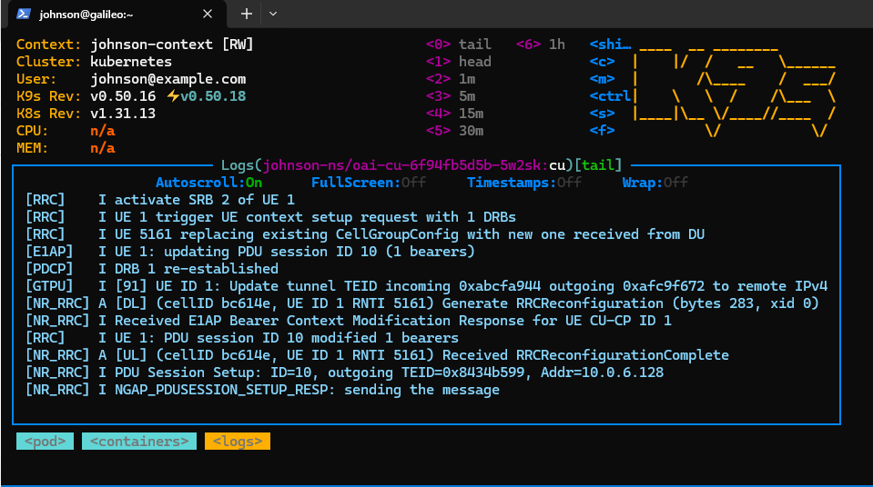
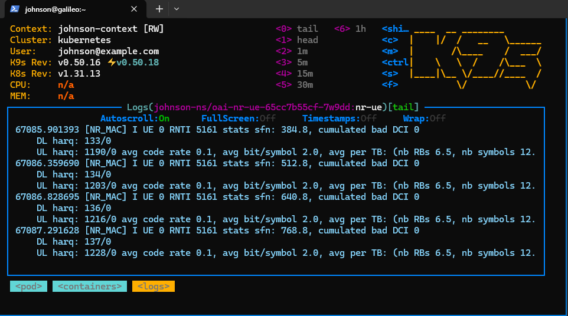

## 1. Clone chart

```bash
git clone https://gitlab.eurecom.fr/oai/orchestration/charts.git
```

```bash
cd charts
```

```bash
git log -1 --oneline

# 3be1aaa (HEAD -> main, tag: v1.0.0, origin/main, origin/HEAD)
#  Change logs, license file and remove non completed charts
```

```bash=
git checkout v1.0.0
```

## 2. Modify Configurations
### CU
- File: `~/charts/oai-5g-ran/oai-cu/values.yaml`
- Compare

| Paramater | Before    | After           |
|:--------- |:--------- | --------------- |
| `amfHost` | "oai-amf" | "192.168.8.108" |

```bash=
amfHost: "192.168.8.108"  # amf ip-address or service-name oai-amf
```

### UE
- File: `~/charts/oai-5g-ran/oai-nr-ue/values.yaml`

| Paramater  | Before                             | After                              |
|:---------- |:---------------------------------- |:---------------------------------- |
| `fullImsi` | "001010000000100"                  | "001010000062653"                  |
| `fullKey`  | "fec86ba6eb707ed08905757b1bb44b8f" | "8baf473f2f8fd09487cccbd7097c6862" |
| `opc`      | "C42449363BBAD02B66D16BC975D77CC1" | "8e27b6af0e692e750f32667a3b14605d"                    |
| `dnn`      | "oai"                              | "Internet"                         |


```bash=
config:
  timeZone: "Europe/Paris"
  rfSimServer: "oai-ran"
  fullImsi: "001010000062653"       # make sure all the below entries are present in the subscriber database
  fullKey: "8baf473f2f8fd09487cccbd7097c6862"
  opc: "8e27b6af0e692e750f32667a3b14605d"
  gdbstack: 1     # 1 to see gdb traces 
  dnn: "Internet"
  sst: "1"              # configure according to gnb and amf, smf and upf 
  # sd: "16777215"
  radio: "rfsim"            # allowed rfsim, b2xx, n3xx, x3xx
  useAdditionalOptions: "-E --rfsim -r 106 --numerology 1 -C 3319680000 --log_config.global_log_options level,nocolor,time"

```

## Run 
- Do rember open corenetwork (Open-5GS: 192.168.8.108)
- Execute CU/DU/UE

```bash=
cd <Path>/oai-5g-ran/oai-cu
helm install oai-cu . -n johnson-ns

cd <Path>/charts/oai-5g-ran/oai-du
helm install oai-du . -n johnson-ns

cd <Path>/oai-5g-ran/oai-nr-ue
helm install oai-ue . -n johnson-ns
```
### Result
- CU

- DU

- UE

- CN
```bash=
01/26 17:18:01.620: [sbi] INFO: [f0e7fd76-fa93-41f0-9f33-2d3cf5357361] NF Instance setup [type:SMF validity:0s] (../lib/sbi/path.c:227)
01/26 17:18:01.620: [amf] INFO: NF EndPoint(addr) setup [127.0.0.4:7777] (../src/amf/nsmf-handler.c:144)
01/26 17:18:01.662: [amf] INFO: [imsi-001010000062653:10:11][0:0:NULL] /nsmf-pdusession/v1/sm-contexts/{smContextRef}/modify (../src/amf/nsmf-handler.c:916)
01/26 17:18:47.101: [amf] INFO: gNB-N2 accepted[192.168.8.35]:6309 in ng-path module (../src/amf/ngap-sctp.c:113)
01/26 17:18:47.101: [amf] INFO: gNB-N2 accepted[192.168.8.35] in master_sm module (../src/amf/amf-sm.c:796)
01/26 17:18:47.118: [amf] INFO: [Added] Number of gNBs is now 2 (../src/amf/context.c:1238)
01/26 17:18:47.118: [amf] INFO: gNB-N2[192.168.8.35] max_num_of_ostreams : 2 (../src/amf/amf-sm.c:842)
```


## Stop

```bash=
helm uninstall oai-cu -n johnson-ns
helm uninstall oai-du -n johnson-ns
helm uninstall oai-ue -n johnson-ns
```