<h1 align="center">Project Documentation - Guideline</h1>

---

> [!WARNING]
> The [SOP template of project documentation](https://github.com/bmw-ece-ntust/SOP/blob/master/project-documentation.md) is regularly updated.  
> Please check it regularly.

> [!CAUTION]
> **Confidentiality Notice:**
> Keep this document **private** by default. Publish only after paper acceptance.
> Request repository access from the GitHub admin.

---

> [!NOTE]
> **Documentation Structure:**
>
> - **Installation Guide**: System setup, configuration, and deployment procedures
> - **User Guide**: Operating instructions for the deployed system
> - **Project Documentation**: Technical architecture, use cases, MSC, flowcharts, and class diagrams with links to installation guides

**Documentation Hierarchy:**

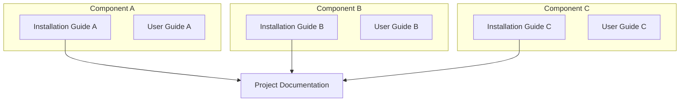

## Table of Contents

> [!TIP]
> **Auto-Generate Table of Contents:**
> Use [Markdown All in One](https://marketplace.visualstudio.com/items?itemName=yzhang.markdown-all-in-one#table-of-contents) extension in VS Code for automatic TOC generation.

- [Table of Contents](#table-of-contents)
- [Introduction](#introduction)
- [Execution Status](#execution-status)
- [Minimum Requirements](#minimum-requirements)
- [System Architecture](#system-architecture)
  - [Software Requirements and Versions](#software-requirements-and-versions)
  - [Components Explanation](#components-explanation)
    - [SMO Layer - O-RAN SC \[L Release\]](#smo-layer---o-ran-sc-l-release)
    - [Near-RT RIC - FlexRIC \[v1.0.0\]](#near-rt-ric---flexric-v100)
    - [Central Unit - OAI \[2024.w40\]](#central-unit---oai-2024w40)
    - [Distributed Unit - OAI \[2024.w40\]](#distributed-unit---oai-2024w40)
    - [Radio Unit - USRP B210](#radio-unit---usrp-b210)
    - [User Equipment](#user-equipment)
- [Use Case Diagram](#use-case-diagram)
- [Message Sequence Chart (MSC)](#message-sequence-chart-msc)
  - [UC2: Handover UEs to Neighbor Cell](#uc2-handover-ues-to-neighbor-cell)
  - [UC3: Shutdown Cell](#uc3-shutdown-cell)
  - [UC4: Activate Cell](#uc4-activate-cell)
- [Flowchart](#flowchart)
  - [UC1: Monitor Traffic Load](#uc1-monitor-traffic-load)
  - [UC2: Handover UEs to Neighbor Cell](#uc2-handover-ues-to-neighbor-cell-1)
  - [UC3: Shutdown Cell](#uc3-shutdown-cell-1)
  - [UC4: Activate Cell](#uc4-activate-cell-1)
- [Class Diagram](#class-diagram)
- [System Parameters](#system-parameters)
- [References](#references)

## Introduction

> [!NOTE]
> **Guideline:** Define the research background, problem statement, contributions, and challenges. Structure the introduction to be suitable for academic paper publication.
>
> **Required Content:**
>
> 1. **Background**: Describe the problem domain and current state-of-the-art
> 2. **Importance**: Explain why solving this problem matters (technical and practical impact)
> 3. **Contribution**: Present your proposed solution and key innovations
> 4. **Challenges**: Identify implementation challenges and how you address them
>
> **Citation Management:**
>
> - Maintain all references in a `.bib` file for bibliography management
> - Use [Pandoc](https://pandoc.org/) to cite references from the `.bib` file in Markdown
> - The `.bib` file can be directly reused for paper writing in LaTeX

**Example:**

This document presents an O-RAN-based energy saving system for 5G Radio Access Networks (RAN), implementing intelligent multi-cell sleep mechanisms through open interfaces [6] and RAN Intelligent Controllers (RICs) [7].

1. **Background**: 
   - Mobile operators face high energy costs from continuously active base stations during low-traffic periods
   - Traditional RAN architectures lack standardized interfaces [2] for coordinated multi-cell energy optimization

2. **Importance**: 
   - Reduces operational costs by 30-40% through dynamic multi-cell energy management
   - Provides vendor-neutral solutions via O-RAN open interfaces while maintaining QoS

3. **Contribution**: 
   - O-RAN-compliant system leveraging ML-based traffic prediction (Non-RT RIC rApp) and real-time control (Near-RT RIC xApp) for dynamic multi-cell activation/deactivation
   - Novel O1/A1 [5]/E2 [6] interface coordination with intelligent handover algorithms [2] minimizing service disruption

4. **Challenges**: 
   - **UE Handover & QoS**: Zero dropped calls during cell transitions [3] while preventing congestion in remaining active cells
   - **Multi-Cell Coordination**: Accurate traffic prediction and reliable O1/A1/E2 communication for synchronized shutdown/activation decisions

## Execution Status

**Guideline:** Track implementation progress with a status table showing all major development and integration steps. Use status icons (✅ ⏳ ❌) to indicate progress. Include specific dates, outcomes, and error descriptions where applicable.

**Example:**

> [!NOTE]
> **Status Icons:**
> - ✅ Completed successfully
> - ⏳ In progress / Pending
> - ❌ Error / Failed (with explanation)

| Step                                                                  | Status | Timeline   | Execution Status / Notes                                |
| --------------------------------------------------------------------- | ------ | ---------- | ------------------------------------------------------- |
| [Install SMO (O-RAN SC L Release)](#smo-installation)                 | ✅     | 2024-10-15 |                                                         |
| [Install Near-RT RIC (FlexRIC v1.0.0)](#nearrt-ric-install)           | ✅     | 2024-10-16 |                                                         |
| [Install CU (OAI 2024.w40)](#cu-installation)                         | ✅     | 2024-10-17 |                                                         |
| [Install DU (OAI 2024.w40)](#du-installation)                         | ✅     | 2024-10-18 |                                                         |
| [Install RU (USRP B210)](#ru-installation)                            | ✅     | 2024-10-19 |                                                         |
| [Integrate SMO with Near-RT RIC (A1 Interface)](#smo-ric-integration) | ✅     | 2024-10-20 |                                                         |
| [Integrate Near-RT RIC with CU (E2 Interface)](#ric-cu-integration)   | ✅     | 2024-10-20 |                                                         |
| [Integrate Near-RT RIC with DU (E2 Interface)](#ric-du-integration)   | ✅     | 2024-10-21 |                                                         |
| [Integrate CU with DU (F1 Interface)](#cu-du-integration)             | ✅     | 2024-10-21 |                                                         |
| [Integrate DU with RU (eCPRI Interface)](#du-ru-integration)          | ✅     | 2024-10-21 |                                                         |
| [Configure O1 Interface (DU to SMO)](#o1-configuration)               | ✅     | 2024-10-21 |                                                         |
| [Develop Energy Saving rApp](#es-rapp-development)                    | ✅     | 2024-10-22 |                                                         |
| [Develop Energy Saving xApp](#es-xapp-development)                    | ✅     | 2024-10-22 |                                                         |
| [Develop Handover (HO) xApp](#ho-xapp-development)                    | ✅     | 2024-10-23 |                                                         |
| [Test Handover xApp Functionality](#ho-xapp-testing)                  | ✅     | 2024-10-23 |                                                         |
| [Test Cell Shutdown Procedure](#cell-shutdown-testing)                | ✅     | 2024-10-24 |                                                         |
| [Test Cell Wake-up Procedure](#cell-wakeup-testing)                   | ⏳      | 2024-10-25 | Blocked: waiting for cell shutdown tests to complete    |
| [End-to-End Energy Saving Test](#e2e-testing)                         | ❌     | 2024-10-26 | Failed: RU failed to reactivate, investigating RF issue |
| Performance Benchmarking                                              |        | 2024-10-28 |                                                         |
| Documentation and Reporting                                           |        | 2024-10-30 |                                                         |

## Minimum Requirements

> [!NOTE]
> **Guideline:** Specify the minimum hardware and software requirements needed to deploy and run the project. Include CPU, GPU, memory, storage, and network requirements.
>
> **Required Content:**
>
> 1. **Hardware Requirements**: CPU, GPU, RAM, storage, network adapters
> 2. **Software Requirements**: OS, kernel version, runtime dependencies, tools
> 3. **Component-Specific Requirements**: List requirements for each major component (SMO, RIC, DU, RU, etc.)
> 4. **Version Specifications**: Include exact versions for reproducibility

**Example:**

| Component       | Requirement                  |
|-----------------|------------------------------|
| CPU             | 2 GHz dual-core processor    |
| GPU             | NVIDIA GTX 1060 or equivalent|
| Memory (RAM)    | 4 GB RAM                     |
| Storage         | 20 GB available disk space   |
| Network         | 100 Mbps Ethernet connection |

## System Architecture

> [!NOTE]
> **Draw.io Files Management:**
>
> If you create system architecture diagrams using draw.io:
>
> - Store the raw `.drawio` files in the `./docs/drawio` folder of the GitHub repository
> - Export diagrams as PNG/SVG and embed them in the documentation
> - Keep `draw.io` files versioned for easy updates and maintenance
> - Use consistent naming: `<project-name>.drawio`

---
> [!NOTE]
> **Guideline:** Draw the end-to-end system architecture using Mermaid diagrams. For each component, provide:
>
> - A **brief component name** with version
> - A **paragraph explanation** of its functionality
> - **Hyperlinks** to corresponding installation guides (use placeholder links)
>
> This format enables easy adaptation into academic paper publications.

**Example:**

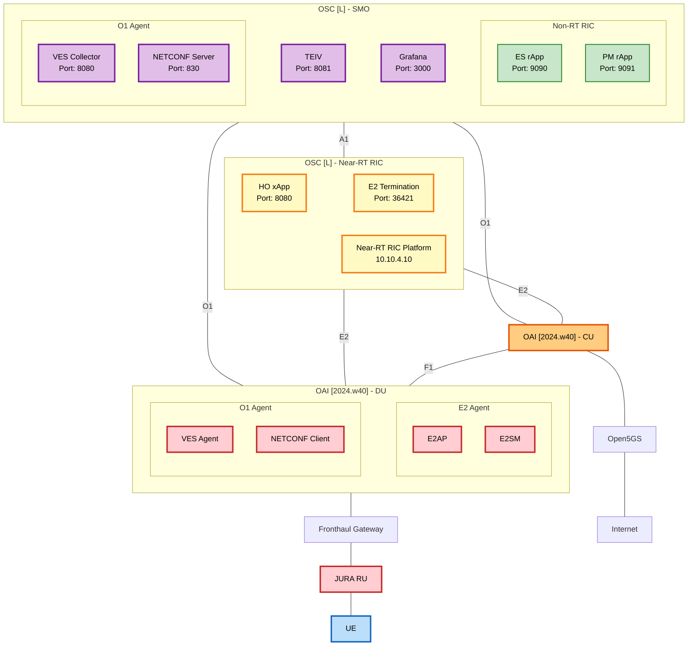

### Software Requirements and Versions

| Component        | Implementation    | Version/Release                                                              | Purpose                              |
| ---------------- | ----------------- | ---------------------------------------------------------------------------- | ------------------------------------ |
| SMO              | O-RAN SC          | [L Release (2024.06)](https://wiki.o-ran-sc.org/display/ORAN/L+Release)      | Service Management and Orchestration |
| Non-RT RIC       | O-RAN SC          | [L Release (2024.06)](https://wiki.o-ran-sc.org/display/ORAN/L+Release)      | Non-Real-Time RIC (inside SMO)       |
| VES Collector    | ONAP VES          | [1.12.5](https://github.com/onap/vnfsdk-validation/releases/tag/1.12.5)      | Event collection and normalization   |
| NETCONF Server   | Netopeer2         | [2.1.71](https://github.com/CESNET/netopeer2/releases/tag/v2.1.71)           | Configuration management protocol    |
| TEIV             | O-RAN SC          | [L Release (2024.06)](https://wiki.o-ran-sc.org/display/ORAN/L+Release)      | Topology & Inventory                 |
| Kafka            | Apache Kafka      | [3.6.2](https://archive.apache.org/dist/kafka/3.6.2/)                        | Message broker for event streaming   |
| Grafana          | Grafana           | [10.0.13](https://github.com/grafana/grafana/releases/tag/v10.0.13)          | Monitoring dashboard                 |
| InfluxDB         | InfluxDB          | [2.7.10](https://github.com/influxdata/influxdb/releases/tag/v2.7.10)        | Time-series metrics storage          |
| ES rApp          | Custom Python     | 1.0.0                                                                        | Energy Saving rApp                   |
| PM rApp          | Custom Python     | 1.0.0                                                                        | Performance Monitoring rApp          |
| Near-RT RIC      | O-RAN SC          | [L Release (2024.06)](https://wiki.o-ran-sc.org/display/ORAN/L+Release)      | Real-time RAN Intelligent Controller |
| ES xApp          | Custom C++        | 1.0.0                                                                        | Energy Saving xApp                   |
| HO xApp          | Custom C++        | 1.0.0                                                                        | Handover xApp                        |
| E2 Termination   | O-RAN SC          | [L Release (2024.06)](https://gerrit.o-ran-sc.org/r/gitweb?p=ric-plt/e2.git) | E2 interface termination             |
| CU-CP            | OAI               | [2024.w40](https://gitlab.eurecom.fr/oai/openairinterface5g/-/tags/2024.w40) | Central Unit Control Plane           |
| CU-UP            | OAI               | [2024.w40](https://gitlab.eurecom.fr/oai/openairinterface5g/-/tags/2024.w40) | Central Unit User Plane              |
| DU               | OAI               | [2024.w40](https://gitlab.eurecom.fr/oai/openairinterface5g/-/tags/2024.w40) | Distributed Unit                     |
| E2 Agent (DU)    | FlexRIC           | [v1.0.0](https://github.com/OpenCellular/FlexRIC/releases/tag/v1.0.0)        | E2 agent for DU                      |
| VES Agent (DU)   | ONAP              | [1.12.5](https://github.com/onap/vnfsdk-validation/releases/tag/1.12.5)      | VES agent for O1 interface           |
| NETCONF Client   | Netopeer2         | [2.1.71](https://github.com/CESNET/netopeer2/releases/tag/v2.1.71)           | NETCONF client for O1 interface      |
| RU (SDR)         | USRP B210         | [UHD 4.6.0](https://github.com/EttusResearch/uhd/releases/tag/v4.6.0.0)      | Radio Unit (RF frontend)             |
| UE Module        | Quectel RM500Q-GL | [RM500QGLABR11A06M4G](https://www.quectel.com/product/5g-rm500q-gl)          | User Equipment (5G modem)            |
| Operating System | Ubuntu            | [22.04.5 LTS](https://releases.ubuntu.com/jammy/)                            | Base system platform                 |
| Docker           | Docker Engine     | [24.0.9](https://docs.docker.com/engine/release-notes/24.0/#2409)            | Container runtime                    |
| Kubernetes       | K8s               | [1.28.15](https://github.com/kubernetes/kubernetes/releases/tag/v1.28.15)    | Container orchestration              |

> [!NOTE]
> **O-RAN Version Naming Convention:**
>
> - **O-RAN Alliance Releases**: Named alphabetically (A, B, C, D, E, F, G, H, I, J, K, L, M...)
> - **O-RAN SC (Software Community)**: Follows Alliance releases with specific dates (e.g., L Release = 2024.06)
> - **OAI Releases**: Version numbers (v1.x, v2.x) with weekly tags (e.g., 2024.w40 = week 40 of 2024)
> - **Current Latest**: L Release (June 2024), M Release expected in December 2024

### Components Explanation

#### [SMO Layer - O-RAN SC [L Release]](installation-guide-link)

- **[SMO Platform](smo-installation-link) (10.10.5.10)**: The Service Management and Orchestration platform [7] serves as the top-level management entity in the O-RAN architecture, providing centralized network management, service orchestration, and policy control. Implemented using O-RAN SC L Release, it communicates with lower layers through O1 [4] and A1 [5] interfaces to configure network functions, collect performance metrics, and enforce high-level policies. The SMO enables network slicing, resource allocation optimization, and lifecycle management of RAN components while maintaining a unified view of the entire network topology.

- **[VES Collector](ves-installation-link) (Port 8080)**: The VES (Virtual Event Streaming) Collector receives fault, performance, and event notifications from RAN components through the O1 interface [4]. It normalizes event data from different vendors into a common format, enabling standardized monitoring and analytics across heterogeneous network elements. VES Collector forwards processed events to Kafka message bus for distribution to rApps and external management systems.

- **[NETCONF Server](netconf-installation-link) (Port 830)**: The NETCONF server provides standards-based configuration management for O-RAN network elements through YANG data models. It handles configuration requests from SMO applications, validates changes against YANG schemas, and applies configurations to RAN nodes via O1 interface [4]. The server maintains configuration versioning, supports transaction rollback, and ensures consistent state management across distributed network components.

- **[TEIV](teiv-installation-link) (Port 8081)**: Topology and Inventory (TEIV) service maintains a real-time graph database of network topology, including physical and logical relationships between RAN components. It tracks cell configurations, neighbor relations, hardware inventory, and network connectivity. TEIV provides APIs for rApps to query topology information, enabling intelligent decision-making for optimization algorithms based on current network structure.

- **[Energy Optimization rApp](rapp-installation-link) (Port 9090)**: The Energy Optimization rApp executes on the SMO platform to provide intelligent energy-saving policies based on long-term network analytics and machine learning models. It analyzes historical traffic patterns, cell utilization, and energy consumption data [1] collected over hours or days to generate optimization policies. The rApp trains ML models to predict traffic demand, determines optimal cell sleep schedules, and deploys these policies to the Near-RT RIC through the A1 interface [5] for real-time execution by xApps.

- **[Performance Monitoring rApp](pm-rapp-installation-link) (Port 9091)**: The Performance Monitoring rApp collects and analyzes long-term KPIs [1] from RAN components, detecting performance degradation trends and network anomalies. It aggregates metrics from multiple sources, generates performance reports, triggers alarms for SLA violations, and provides insights for capacity planning. The rApp supports custom analytics workflows and integrates with visualization tools to present network performance trends to operators.

- **[Grafana Dashboard](grafana-installation-link) (Port 3000)**: Grafana provides the web-based visualization and monitoring interface for network operators. It displays real-time and historical metrics including cell throughput, UE connections, resource utilization, and energy consumption across all network layers. Operators can create custom dashboards, configure alert thresholds, analyze performance trends, and correlate events across different network domains through interactive visualizations.

#### [Near-RT RIC - FlexRIC [v1.0.0]](flexric-installation-link)

<Add component explanation>

#### [Central Unit - OAI [2024.w40]](oai-cu-installation-link)

<Add component explanation>

#### [Distributed Unit - OAI [2024.w40]](oai-du-installation-link)

<Add component explanation>

#### [Radio Unit - USRP B210](usrp-installation-link)

<Add component explanation>

#### [User Equipment](ue-installation-link)

<Add component explanation>
| Kubernetes      | 1.18 or higher               |

## Use Case Diagram

> [!NOTE]
> **Guideline:** Define the system features and use cases that fulfill project requirements. Use Mermaid diagrams to illustrate actors, use cases, and their relationships. Each use case will be detailed in the MSC section.
>
> **Required Content:**
>
> 1. **Use Case Diagram**: Mermaid diagram showing actors and their interactions with the system
> 2. **Actor Definitions**: Identify all external entities (users, systems, components)
> 3. **Use Case Definitions**: List all functional capabilities with clear names
> 4. **Relationships**: Show interactions between actors and use cases

**Example:**

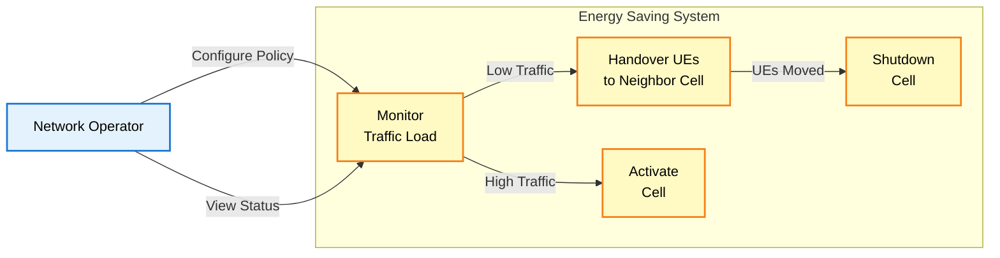

## Message Sequence Chart (MSC)

> [!NOTE]
> **Guideline:** Illustrate component interactions for each use case using sequence diagrams. Focus on message flow across system interfaces (O1, A1, E2, F1 for O-RAN). MSC shows **component communication**, while flowcharts show **algorithm logic**.
>
> **Required Content:**
>
> 1. **Sequence Diagrams**: Mermaid diagrams showing message exchanges between components
> 2. **Interface Labels**: Include interface names (O1, A1, E2, F1, eCPRI, Uu)
> 3. **Message Content**: Document message parameters and data structures
> 4. **Timing**: Show order of operations and dependencies
> 5. **Error Scenarios**: Include alternative flows and error handling where relevant

**Example:**

### UC2: Handover UEs to Neighbor Cell

This MSC shows the handover procedure when the Energy Saving xApp decides to move UEs from a low-traffic cell to a neighbor cell before shutdown.

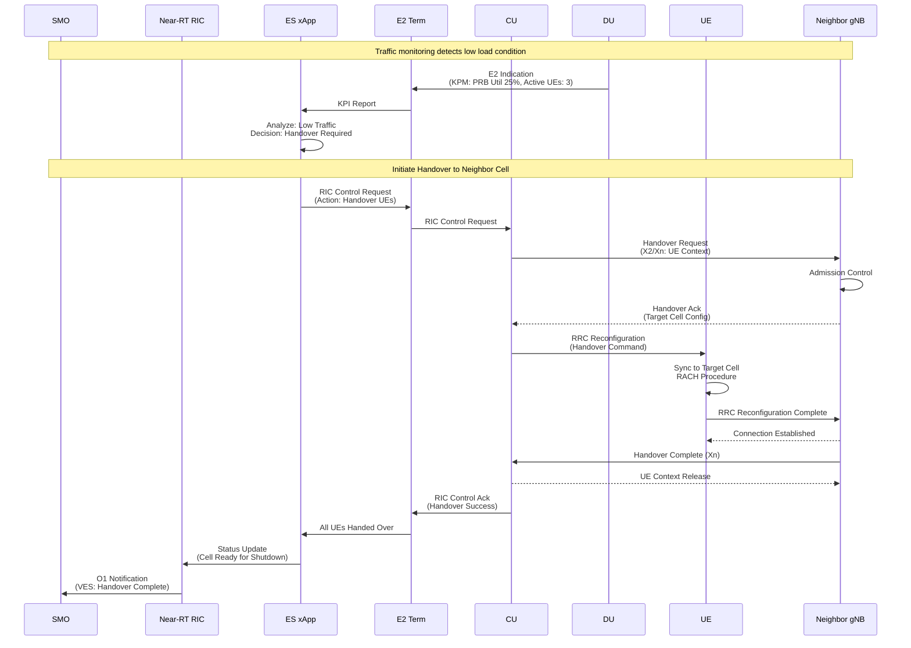

### UC3: Shutdown Cell

This MSC shows the cell shutdown procedure after all UEs have been successfully handed over to neighbor cells.

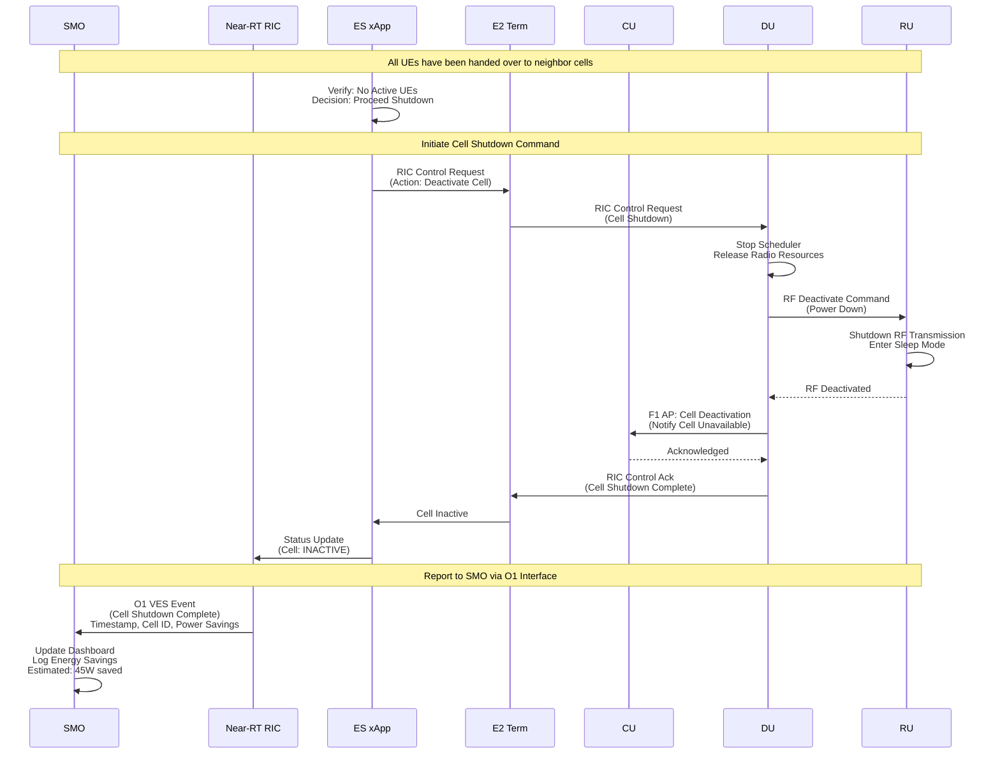

### UC4: Activate Cell

This MSC shows the cell activation procedure when traffic load increases and additional capacity is needed.

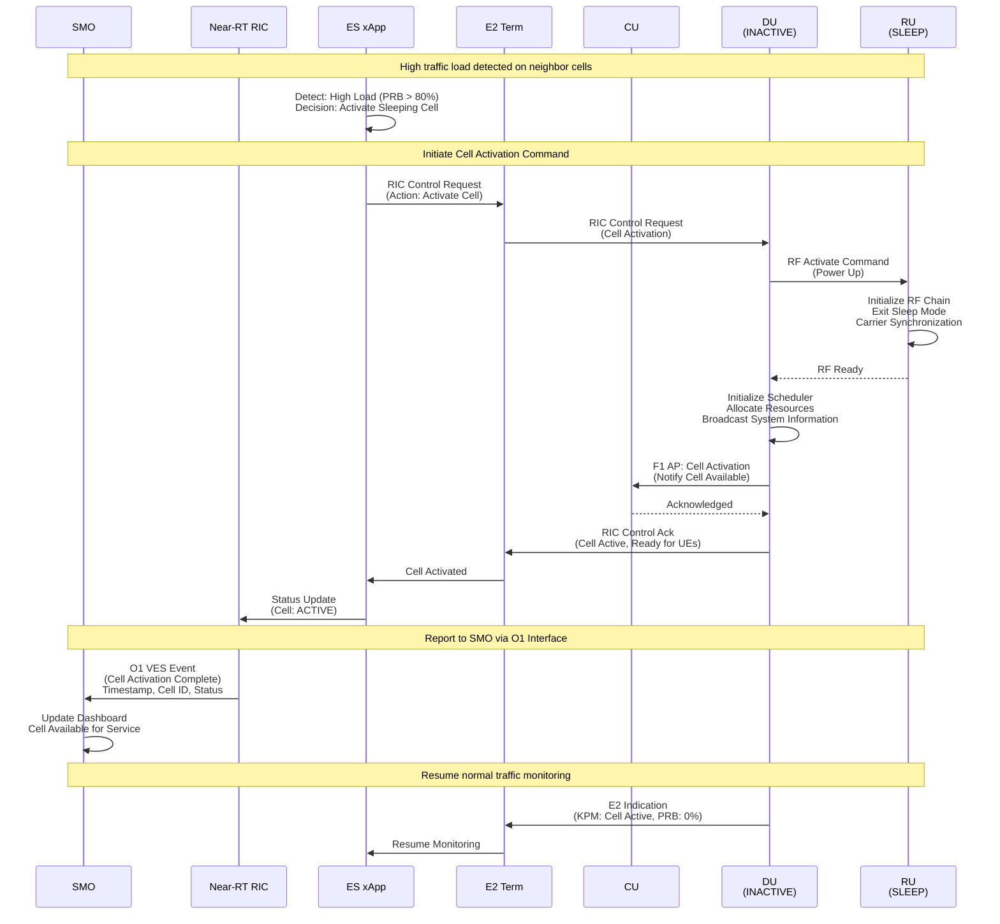

## Flowchart

> [!NOTE]
> **Guideline:** Define the logic and decision-making algorithms for each use case. Flowcharts illustrate **algorithm logic** (conditional branches, loops, decision criteria), while MSC shows **component interactions**.
>
> **Required Content:**
>
> 1. **Decision Points**: Show conditional branches using diamond shapes
> 2. **Logic Flow**: Include if/else logic and loops with clear conditions
> 3. **Threshold Values**: Document criteria and parameters for decisions
> 4. **Error Handling**: Show alternative paths for failure scenarios
> 5. **Clear Styling**: Use consistent colors and ensure text readability

**Example:**

### UC1: Monitor Traffic Load

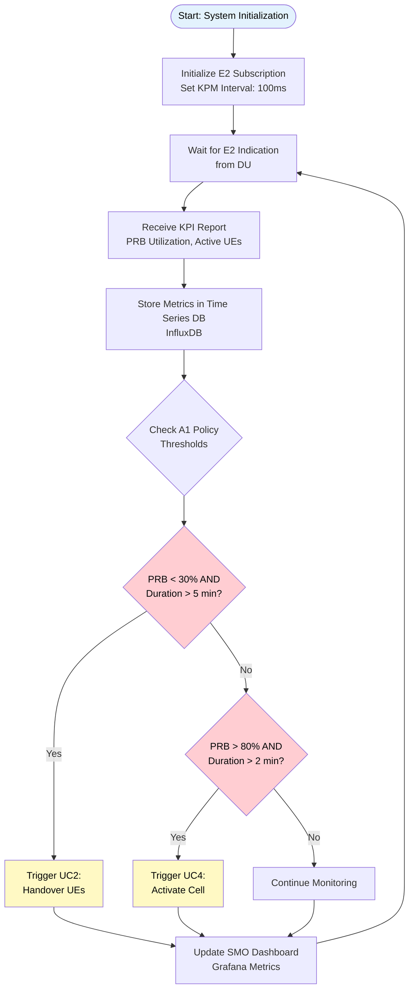

### UC2: Handover UEs to Neighbor Cell

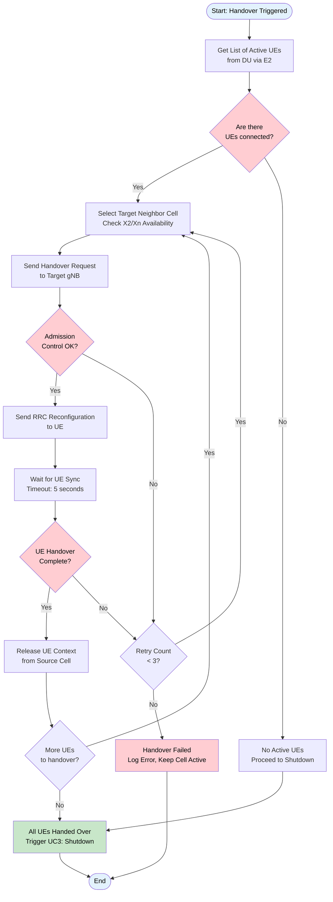

### UC3: Shutdown Cell

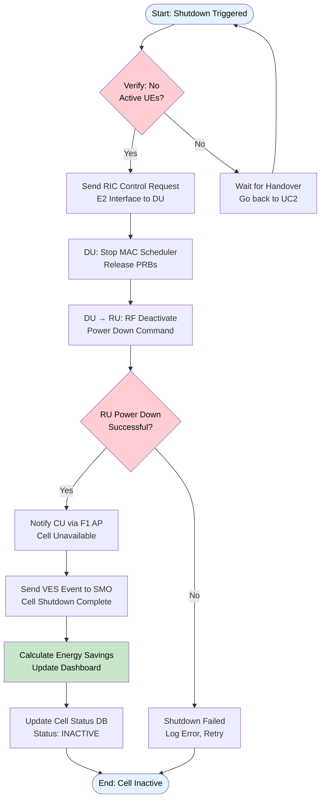

### UC4: Activate Cell

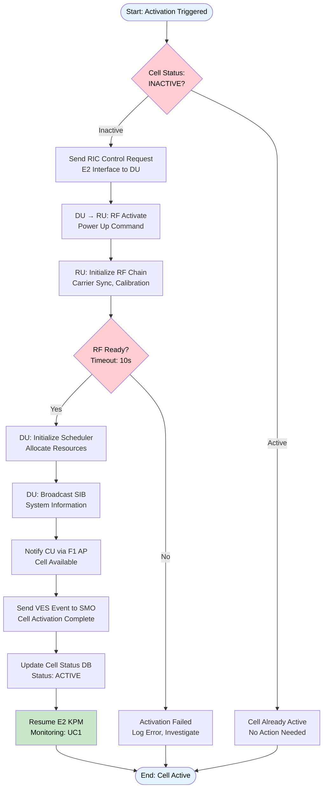

## Class Diagram

> [!NOTE]
> **Guideline:** Define the software architecture using Object-Oriented Programming (OOP) principles. Include classes, attributes (following 3GPP standards), methods, and relationships (inheritance, composition, aggregation).
> Include the parameters defined on the [System Parameters](#system-parameters) table.
>
> **Required Content:**
>
> 1. **Classes**: Define main classes following OOP design patterns
> 2. **Attributes**: Use 3GPP parameter names (e.g., `DRB.PrbUtilDL`, `RRC.ConnectedUE`)
> 3. **Methods**: Define functions that execute MSC call-flows
> 4. **Relationships**: Show inheritance (is-a), composition (has-a), aggregation, dependencies
> 5. **Access Modifiers**: Use `-` for private, `+` for public, `#` for protected
> 6. **Data Types**: Specify types (String, Integer, Float, List, etc.)
>
> **OOP Principles:**
>
> - **Encapsulation**: Group related data and methods in classes
> - **Abstraction**: Use interfaces or abstract classes where applicable
> - **Inheritance**: Show class hierarchies (e.g., `BaseXApp` → `EnergySavingXApp`)
> - **Polymorphism**: Define overridable methods

## System Parameters

> [!NOTE]
> **Guideline:** Define the input and output parameters used in the system, following 3GPP specifications. These parameters should be reflected in the class diagram attributes.
>
> **Required Content:**
>
> 1. **Input Parameters**: System inputs (e.g., KPIs from E2 interface, A1 policies)
> 2. **Output Parameters**: System outputs (e.g., control decisions, cell status)
> 3. **3GPP Standards**: Reference TS specifications for each parameter with hyperlinks
> 4. **Parameter Table**: Include columns for Category, Parameter, Type, 3GPP Spec, Unit, Description, Range, Source/Destination

**Example:**

| Category               | Parameter              | Type    | Unit       | 3GPP Spec                                                                                      | Description                             |
| ---------------------- | ---------------------- | ------- | ---------- | ---------------------------------------------------------------------------------------------- | --------------------------------------- |
| **E2 KPM Inputs**      | `DRB.PrbUtilDL`        | Float   | %          | [TS 28.552 §5.1.1.12.1](https://www.3gpp.org/ftp/Specs/archive/28_series/28.552/28552-i50.zip) | Downlink PRB utilization                |
|                        | `DRB.PrbUtilUL`        | Float   | %          | [TS 28.552 §5.1.1.12.2](https://www.3gpp.org/ftp/Specs/archive/28_series/28.552/28552-i50.zip) | Uplink PRB utilization                  |
|                        | `DRB.UEThpDL`          | Float   | kbps       | [TS 28.552 §5.1.1.10.1](https://www.3gpp.org/ftp/Specs/archive/28_series/28.552/28552-i50.zip) | DL UE throughput                        |
|                        | `DRB.UEThpUL`          | Float   | kbps       | [TS 28.552 §5.1.1.10.2](https://www.3gpp.org/ftp/Specs/archive/28_series/28.552/28552-i50.zip) | UL UE throughput                        |
|                        | `RRC.ConnectedUE`      | Integer | count      | [TS 28.552 §5.1.1.1.1](https://www.3gpp.org/ftp/Specs/archive/28_series/28.552/28552-i50.zip)  | Number of active UEs                    |
| **E2 RC Outputs**      | `cellActivationCmd`    | Enum    | -          | [TS 38.331 §6.2.2](https://www.3gpp.org/ftp/Specs/archive/38_series/38.331/38331-i40.zip)      | Cell activation command                 |
|                        | `handoverCmd`          | Struct  | -          | [TS 38.300 §9.2.3.2](https://www.3gpp.org/ftp/Specs/archive/38_series/38.300/38300-i00.zip)    | Handover command                        |
|                        | `targetCellId`         | String  | -          | [TS 36.413 §9.1.2.1](https://www.3gpp.org/ftp/Specs/archive/36_series/36.413/36413-i10.zip)    | Target cell identifier                  |
| **A1 Policy Inputs**   | `prbThresholdLow`      | Float   | %          | [O-RAN.WG2.A1AP-v06.00 §8.2](https://specifications.o-ran.org/)                                | Low PRB threshold for cell sleep        |
|                        | `prbThresholdHigh`     | Float   | %          | [O-RAN.WG2.A1AP-v06.00 §8.2](https://specifications.o-ran.org/)                                | High PRB threshold for cell wake        |
|                        | `durationThresholdSec` | Integer | seconds    | [O-RAN.WG2.A1AP-v06.00 §8.2](https://specifications.o-ran.org/)                                | Minimum duration before action          |
| **Radio Measurements** | `RSRP`                 | Integer | dBm        | [TS 36.214 §5.1.1](https://www.3gpp.org/ftp/Specs/archive/36_series/36.214/36214-i40.zip)      | Reference Signal Received Power         |
|                        | `RSRQ`                 | Integer | dB         | [TS 36.214 §5.1.2](https://www.3gpp.org/ftp/Specs/archive/36_series/36.214/36214-i40.zip)      | Reference Signal Received Quality       |
|                        | `SINR`                 | Integer | dB         | [TS 36.214 §5.1.4](https://www.3gpp.org/ftp/Specs/archive/36_series/36.214/36214-i40.zip)      | Signal to Interference plus Noise Ratio |
| **O1 VES Events**      | `cellStatusChange`     | Event   | -          | [TS 28.532 §5.2.6.2](https://www.3gpp.org/ftp/Specs/archive/28_series/28.532/28532-i50.zip)    | Cell state change notification          |
|                        | `energySavingEstimate` | Float   | Watts      | -                                                                                              | Estimated power savings                 |
|                        | `timestamp`            | Long    | Unix epoch | [TS 28.532 §5.1](https://www.3gpp.org/ftp/Specs/archive/28_series/28.532/28532-i50.zip)        | Event timestamp                         |

**Example:**

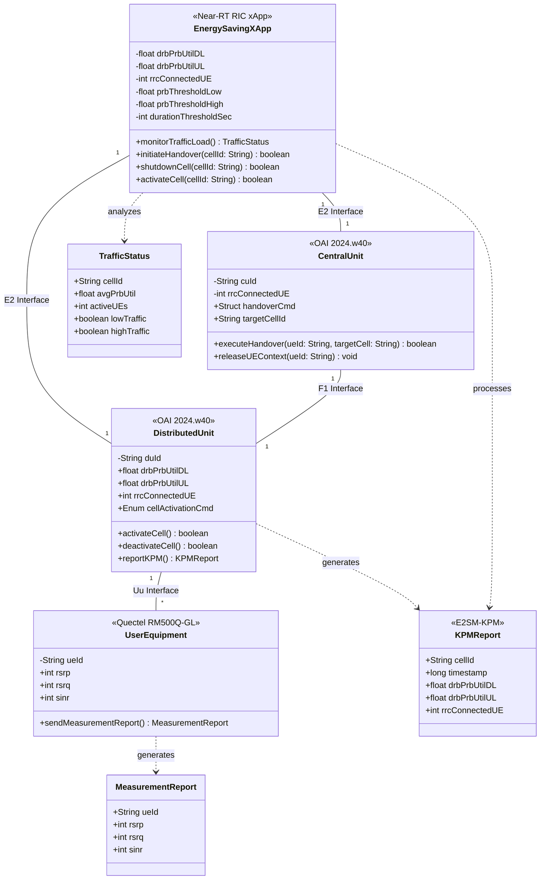

## References

> [!NOTE]
> **Guideline:** Use IEEE citation style for all references. Cite references in the text using numerical format [1], [2], etc., and list them in order of appearance at the end of the document.
>
> **Citation Format:**
>
> - In-text citations: Use square brackets with numbers [1], [2], [3]
> - Multiple citations: [1], [2] or [1]–[3] for ranges
> - References list: Number sequentially in order of first appearance
>
> **For Pandoc Conversion:**
>
> - Create a `references.bib` file with BibTeX entries
> - Use Pandoc with IEEE CSL: `pandoc document.md --bibliography=references.bib --citeproc --csl=ieee.csl -o output.pdf`
> - Download `ieee.csl` from: https://github.com/citation-style-language/styles/blob/master/ieee.csl

**Example References (IEEE Format):**

[1] 3GPP, "Management and orchestration; 5G performance measurements," 3rd Generation Partnership Project (3GPP), Technical Specification TS 28.552 V18.5.0, 2024. [Online]. Available: https://www.3gpp.org/ftp/Specs/archive/28_series/28.552/

[2] 3GPP, "NR; NR and NG-RAN Overall description; Stage-2," 3rd Generation Partnership Project (3GPP), Technical Specification TS 38.300 V18.0.0, 2024. [Online]. Available: https://www.3gpp.org/ftp/Specs/archive/38_series/38.300/

[3] 3GPP, "NR; Radio Resource Control (RRC) protocol specification," 3rd Generation Partnership Project (3GPP), Technical Specification TS 38.331 V18.4.0, 2024. [Online]. Available: https://www.3gpp.org/ftp/Specs/archive/38_series/38.331/

[4] 3GPP, "Management and orchestration; Generic management services," 3rd Generation Partnership Project (3GPP), Technical Specification TS 28.532 V18.5.0, 2024. [Online]. Available: https://www.3gpp.org/ftp/Specs/archive/28_series/28.532/

[5] O-RAN Alliance, "O-RAN.WG2.A1AP-v06.00: O-RAN A1 interface: Application Protocol," O-RAN Alliance, Technical Specification, 2024. [Online]. Available: https://specifications.o-ran.org/

[6] O-RAN Alliance, "O-RAN.WG3.E2AP-v03.01: O-RAN E2 Application Protocol," O-RAN Alliance, Technical Specification, 2024. [Online]. Available: https://specifications.o-ran.org/

[7] O-RAN Software Community, "O-RAN Software Community L Release," 2024. [Online]. Available: https://wiki.o-ran-sc.org/display/ORAN/L+Release. [Accessed: Oct. 24, 2024].

[8] EURECOM, "OpenAirInterface 5G RAN Implementation," Version 2024.w40, 2024. [Online]. Available: https://gitlab.eurecom.fr/oai/openairinterface5g
